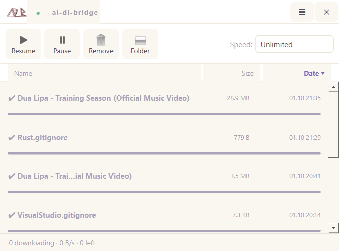

# ai-dl-bridge

<p align="center">
  
</p>

<p align="center">
  <strong>The Missing Download Bridge for AI Agents.</strong><br>
  A lightweight, tray-first Windows application that gives LLMs and coding agents a single local doorway to download files, datasets, and high-res DASH videos — while you retain full IDM-style progress visibility and control.
</p>

<p align="center">
  
  
  
  
  
  
  <a href="LICENSE"></a>
</p>

---



## Why ai-dl-bridge?

When autonomous AI agents (Claude Code, Cursor, Kimi, local models, or custom agentic scripts) work on tasks, they frequently need to download datasets, papers, media, or archives. Letting agents trigger blind `curl` or `urllib` calls in the background causes critical pain points:
- **No Visibility:** No progress indicator, remaining time, or download speed.
- **No Control:** Inability to pause, throttle, or cancel runaway downloads.
- **Broken Videos:** Modern platforms (YouTube, etc.) serve video and audio as separate DASH streams. Simple downloaders yield audio-less video or low-res fallback streams.
- **Memory & Bandwidth Flooding:** Massive files (>2GB) can silently saturate system bandwidth and disk storage.

**ai-dl-bridge solves this with a Single Local Gateway (`POST /indir`).** An AI simply sends a link; the bridge resolves metadata, routes the transfer through multi-segmented `aria2`, merges media streams with `ffmpeg`, and visualizes everything inside a frameless, aesthetic mini control panel.

---

## Architecture

```
[ AI Agent ] ─── POST /indir ───> [ FastAPI Gateway (127.0.0.1:8765+) ]
 (Claude / Cursor / Scripts)               │
                                           ├─► [ Link Resolver ] ── yt-dlp (metadata & streams)
                                           ├─► [ Safety Policy ] ── >2GB check (auto-pause safety)
                                           └─► [ aria2 RPC ] ────── Multi-connection download engine
                                                    ▲
                                                    │ 1s Polling & Control
[ Target: downloads/ ] <─── [ FFmpeg Muxer ] <─── [ PyQt6 Desktop UI ] (Tray, Speed Limiter, History)
```

---

## Features

- **Single Door for All Agents:** Unauthenticated local REST API (`http://127.0.0.1:8765/indir`). Automatic port collision failover (8765 → 8784).
- **High-Resolution DASH Video Handling:** Resolves separate video and audio streams, downloads both via `aria2` multi-connection streams, and automatically muxes them using bundled `ffmpeg` (`-c copy`, lossless, zero re-encoding). Verified up to 2560×1440@60fps.
- **IDM-Style Pastel Mini Window:** Frameless, compact window with Resume, Pause, Remove, and Folder opening controls.
- **Smart Column Sorting:** Interactive column headers (`Name`, `Size`, `Date`) with multi-directional sorting.
- **Global Speed Limiter:** On-the-fly throttling (`Unlimited`, `1 MB/s`, `5 MB/s`, `10 MB/s`, `25 MB/s`, `Custom`).
- **Persistent History & Queue Recovery:** Completed downloads and interrupted video merge jobs survive application restarts (`%APPDATA%/ai-dl-bridge/gecmis.json`).
- **Safety Policy:** Files exceeding 2 GB are automatically placed in `paused` mode awaiting human approval.
- **Tray-First Lifecycle:** Closing the window minimizes to the system notification tray; optional Windows autostart.

---

## Quick Start

### Option A: Portable Standalone Executable (Recommended)

Download `ai-dl-bridge.exe` from [Releases](https://github.com/emirhanoguz/ai-dl-bridge/releases). It bundles Python, PyQt6, FastAPI, `aria2c`, `yt-dlp`, and `ffmpeg` into a zero-dependency portable binary:

```powershell
# Run with window:
.\ai-dl-bridge.exe

# Or start silently minimized to tray:
.\ai-dl-bridge.exe --gizli
```

### Option B: Run from Source

```bash
git clone https://github.com/emirhanoguz/ai-dl-bridge.git
cd ai-dl-bridge

# 1. Install dependencies
pip install -r requirements.txt

# 2. Place companion binaries in tools/ (see tools/README.md)
# tools/aria2c.exe, tools/yt-dlp.exe, tools/ffmpeg.exe

# 3. Start the application
python run.py
```

---

## API Specification

### `POST /indir`

Initiates a download job.

#### Request Body
```json
{
  "link": "https://www.youtube.com/watch?v=...",
  "kimlik": "claude-code",
  "kalite": "video"
}
```

| Parameter | Type | Required | Default | Description |
|---|---|---|---|---|
| `link` | string | Yes | — | Direct file URL or video streaming URL |
| `kimlik` | string | No | `"anonim"` | Identifier of the calling agent (shown in UI) |
| `kalite` | string | No | `"video"` | Quality profile: `video`, `ses`, `eniyi`, `endusuk` |

#### Quality Profiles
- `video` (default): Best video + best audio streams merged into `.mp4`.
- `ses`: Best standalone audio stream (`.m4a`).
- `eniyi`: Best single combined stream.
- `endusuk`: Smallest direct stream (ideal for testing or bandwidth preservation).

#### Responses
- **`200 OK` (Accepted):**
  ```json
  {"durum": "kabul", "id": "2089b05e0a3d4f"}
  ```
- **`200 OK` (Approval Needed - Size > 2GB):**
  ```json
  {"durum": "beklemede", "sebep": "2GB üstü onay bekliyor"}
  ```
- **`400 Bad Request` (Invalid link or resolver error):**
  ```json
  {"durum": "reddedildi", "sebep": "Video çözülemedi: site yanıt vermiyor"}
  ```

---

## Agent Integration

### Using cURL
```bash
curl -X POST http://127.0.0.1:8765/indir \
  -H "Content-Type: application/json" \
  -d '{"link": "https://example.com/dataset.zip", "kimlik": "agent"}'
```

### Using Python
```python
import urllib.request
import json

payload = {"link": "https://example.com/data.parquet", "kimlik": "research-bot"}
req = urllib.request.Request(
    "http://127.0.0.1:8765/indir",
    data=json.dumps(payload).encode("utf-8"),
    headers={"Content-Type": "application/json"}
)
with urllib.request.urlopen(req) as resp:
    print(json.loads(resp.read().decode("utf-8")))
```

### Pre-packaged Agent Skill
A plug-and-play agent skill is provided in [`skills/ai-indirme-koprusu/`](skills/ai-indirme-koprusu/SKILL.md). It monitors progress until completion, handles policy approvals, and reports disk locations back to the agent.

---

## Testing & Packaging

### Run Test Suite
```bash
python -m pytest tests/ -v
# 48 tests across core, RPC, resolver, UI viewmodel, and video muxing
```

### Build Single-File Executable
```bash
python -m PyInstaller ai-dl-bridge.spec --noconfirm
# Generates self-contained dist/ai-dl-bridge.exe
```

---

## Tech Stack

- **GUI:** PyQt6
- **Server:** FastAPI, Uvicorn
- **Engine:** aria2 (JSON-RPC)
- **Video & Media:** yt-dlp, FFmpeg
- **Packaging:** PyInstaller

---

## License

This project is licensed under the MIT License — see the [LICENSE](LICENSE) file for details.
© 2026 Emirhan Oğuz.
